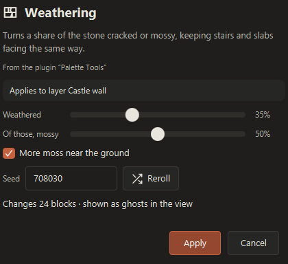

# Writing BlockDesigner plugins

A plugin is a `.jar` that BlockDesigner loads at startup, each in its own class loader. It can add schematic formats, exporters, importers, menu actions, `/commands`, transforms with a live preview, side panels and tools, and it can read and edit the open project with full undo.

This guide covers setting up a plugin project, the manifest, installing and testing, and every extension point with examples taken from the two example plugins in this repository. For a list of every type in the API see [docs/plugin-api-reference.md](docs/plugin-api-reference.md); for the design notes behind API 2 see [docs/plugin-api-v2.md](docs/plugin-api-v2.md).

**Contents**

- [Getting started](#getting-started): [examples](#the-examples) · [project setup](#project-setup) · [manifest](#the-manifest-blockdesigner-pluginjson) · [entry point](#the-entry-point) · [install and test](#install-and-test)
- [API 1 extension points](#api-1-extension-points): [commands](#commands) · [actions](#menu-actions) · [exporters](#exporters) · [schematic formats](#schematic-formats) · [editing the scene](#reading-and-editing-the-scene)
- [API 2 extension points](#api-2-extension-points): [options](#options-parameters-without-writing-ui) · [transforms](#transforms) · [panels](#panels) · [tools](#tools) · [importers](#importers) · [richer exporters](#exporters-options-summary-progress) · [scene events](#scene-events) · [block catalog](#the-block-catalog) · [asset access](#asset-access) · [Bedrock NBT](#bedrock-nbt)
- [Rules of the road](#rules-of-the-road) · [Limits and what's not supported yet](#limits-and-whats-not-supported-yet)

## What a plugin can add

| Extension point | API | Where it shows up |
|---|---|---|
| `registerCommand(PluginCommand)` | 1 | A `/command` in the command bar (T or /), with completion and `/help` |
| `registerAction(PluginAction)` | 1 | An entry in the Plugins menu in the top bar |
| `registerExporter(PluginExporter)` | 1 | A card in the Export window, for outputs that aren't schematics (reports, a mod's own files, folders) |
| `registerFormat(SchematicFormat)` | 1 | Import (file filter, drag and drop) and a card in the Export window |
| `registerTransform(PluginTransform)` | 2 | Plugins › Transform, the viewport's right-click menu and `/transform <id>`: a dialog with options, a live ghost preview and Apply as one undo step |
| `registerPanel(PluginPanel)` | 2 | A closable tab in the right-hand panel, with your own JavaFX content |
| `registerTool(PluginTool)` | 2 | A button in the tool dock over the viewport; mouse, wheel and keys go to your handler |
| `registerImporter(PluginImporter)` | 2 | Import (file filter, drag and drop) for files that aren't schematics, such as images |

API 2 also adds exporter options, summaries and progress; declarative `Options`; scene events (`ctx.on(...)`); the block catalog (`ctx.blocks()`); and asset access (`ctx.assets()`).

When a plugin is disabled, or fails while enabling, BlockDesigner removes everything it registered.

## Getting started

### The examples

The repository has two complete plugins. Read them alongside this guide:

- [`examples/hello-plugin`](examples/hello-plugin) (API 1): a `/pillar` command, an "Add test platform" action, a CSV bill-of-materials exporter and a plain-text schematic format.
- [`examples/palette-tools`](examples/palette-tools) (API 2): Weathering, Palette swap and Gradient transforms, a Palette panel, a GIMP colour-palette exporter with options, a pixel-art importer and a Wall tool.

Build them from the repository root:

```
./gradlew :examples:hello-plugin:jar :examples:palette-tools:jar
```

The jars land in `examples/*/build/libs/`. Install them as described in [Install and test](#install-and-test).

### Project setup

Plugins compile against two jars: the plugin API and `core`, which the API exposes (block states, structures, layers, NBT, schematic formats). Build them from the repository:

```
./gradlew :plugin-api:jar :core:jar
```

This writes `plugin-api/build/libs/blockdesigner-plugin-api-<version>.jar` and `core/build/libs/core-<version>.jar`. Copy them into your project (for example into `libs/`) and depend on them as **`compileOnly`**: BlockDesigner provides both at runtime, so never bundle them into your jar. Your own libraries can be shaded into the jar.

A minimal `build.gradle.kts`:

```kotlin
plugins {
    java
}

dependencies {
    compileOnly(files("libs/blockdesigner-plugin-api-0.4.6.jar", "libs/core-0.4.6.jar"))
}

tasks.withType<JavaCompile>().configureEach {
    options.release = 25   // the API jars are Java 25 class files; target 25 or lower
}
```

You need JDK 25 or newer to compile against the API jars.

Panels are the only part of the API that uses JavaFX. If you make one, compile against JavaFX too, also `compileOnly` (BlockDesigner ships JavaFX 26). With the OpenJFX Gradle plugin, as [`examples/palette-tools/build.gradle.kts`](examples/palette-tools/build.gradle.kts) does:

```kotlin
plugins {
    java
    id("org.openjfx.javafxplugin") version "0.1.0"
}

javafx {
    version = "26.0.2"
    modules = listOf("javafx.controls")
    configuration = "compileOnly"
}
```

### The manifest: `blockdesigner-plugin.json`

Put `blockdesigner-plugin.json` at the root of the jar (in Gradle, `src/main/resources/blockdesigner-plugin.json`). This is `palette-tools`' manifest:

```json
{
  "id": "palette-tools",
  "name": "Palette Tools",
  "version": "1.0.0",
  "author": "BlockDesigner",
  "description": "Example plugin for API 2: weathering, palette swap and gradient transforms, a Palette panel, a colour palette exporter, a pixel art importer and a Wall tool.",
  "main": "com.example.palette.PaletteToolsPlugin",
  "api": 2
}
```

| Field | Required | Meaning |
|---|---|---|
| `id` | yes | Unique plugin id, using only `a-z 0-9 _ . -`. Two jars with the same id can't both load. |
| `main` | yes | Class implementing `BlockDesignerPlugin`, with a public no-argument constructor. |
| `name` | no | Display name (defaults to the id). |
| `version`, `author`, `description` | no | Shown in the Plugins window and the install prompt. |
| `api` | no | The plugin API version the plugin needs (defaults to `1`). |

**API versions.** The current API is **2** (`PluginApi.VERSION`).

- `"api": 1`: commands, menu actions, exporters, schematic formats and scene edits (`editWorld`, `editor()`, `addLayer`).
- `"api": 2`: everything in API 1 plus options, scene events, the block catalog, asset access, transforms, panels, tools, importers, and options / summary / progress for exporters.

Declare the lowest version whose features you use. BlockDesigner refuses plugins that ask for a newer API than it has (they show as *needs a newer BlockDesigner* in the Plugins window) and keeps loading older ones, so API 1 plugins run unchanged on an API 2 BlockDesigner.

### The entry point

`main` implements `BlockDesignerPlugin`. Register everything in `enable`; `disable` is optional and only needed for resources you created yourself (threads, open files), because everything registered through the context is removed automatically.

```java
public final class PaletteToolsPlugin implements BlockDesignerPlugin {
    @Override
    public void enable(PluginContext ctx) {
        ctx.registerTransform(new WeatheringTransform());
        ctx.registerTransform(new PaletteSwapTransform());
        ctx.registerTransform(new GradientTransform());
        ctx.registerPanel(new PalettePanel());
        ctx.registerExporter(new GimpPaletteExporter(ctx.blocks()));
        ctx.registerImporter(new PixelArtImporter());
        ctx.registerTool(new WallTool());
    }
}
```

`PluginContext` also gives you `info()` (your manifest), `dataFolder()` (a folder of your own, created on first call), `log(...)` (the log shown in the Plugins window), `status(...)` (status bar), `toast(...)` (a short message over the 3D view) and `runOnUiThread(...)`.

### Install and test

BlockDesigner loads every `.jar` in its plugins folder at startup:

- installed version: `%APPDATA%\BlockDesigner\plugins`
- portable build: `data\plugins` next to `BlockDesigner.exe`

Open **Plugins (puzzle icon) › Manage plugins…** (also in Settings › General). From there you can:

- **Install…** a jar: BlockDesigner reads its manifest, asks for confirmation (plugins run with full access to the computer), copies it into the plugins folder, replacing an older copy of the same plugin id, and enables it.
- **Open folder** to copy jars in by hand, then **Reload** to rescan the folder. Reload is also the quickest way to test a rebuilt jar.
- Switch each plugin **on or off** with its check box (remembered between runs), or **uninstall** it (deletes the jar; if Windows still has it locked, delete it after a restart).
- See each plugin's state (*on* with what it registered, *off*, *failed to start*, *needs a newer BlockDesigner*), its error if it failed, and its **log**: your `ctx.log(...)` lines and any exceptions your callbacks threw.

## API 1 extension points

The examples in this section come from [`HelloPlugin.java`](examples/hello-plugin/src/main/java/com/example/hello/HelloPlugin.java) and [`TextFormat.java`](examples/hello-plugin/src/main/java/com/example/hello/TextFormat.java).

### Commands

A `PluginCommand` adds a WorldEdit-style command to the command bar (T or /), with its usage shown while typing and a line in `/help`. Names use `a-z 0-9 _`. The handler gets a `Context` with the arguments (`args`, with `-x` flags split out into `flags`), a `world` of every visible, unlocked layer merged in world coordinates, the `//pos1 //pos2` `region`, the aimed block (`aim`), the held block (`hand`) and a block resolver. Everything written to `c.world()` is one undo step. Throw `IllegalArgumentException` for a friendly error in the command bar; return the success message.

```java
ctx.registerCommand(new PluginCommand("pillar", "/pillar <height> [block]", "Build a pillar on the aimed block", c -> {
    if (c.args().isEmpty()) throw new IllegalArgumentException("Usage: /pillar <height> [block]");
    int height;
    try {
        height = Integer.parseInt(c.args().getFirst());
    } catch (NumberFormatException e) {
        throw new IllegalArgumentException("Height must be a number");
    }
    BlockState block = c.args().size() > 1 ? c.blocks().resolve(c.args().get(1))
            : c.hand().orElse(BlockState.of("minecraft:stone_bricks"));
    BlockPos base = c.aim().orElseThrow(() -> new IllegalArgumentException("Aim at a block first"));
    for (int y = 1; y <= height; y++) c.world().set(base.add(0, y, 0), block);
    return "Built a " + height + "-block pillar of " + block.path();
}));
```

`c.requireRegion()` returns the region or fails with "Select a region first".

### Menu actions

A `PluginAction` is an entry in the Plugins menu: a label, a tooltip and a `Runnable` that runs on the JavaFX thread.

```java
ctx.registerAction(new PluginAction("Add test platform", "A 9×9 stone platform in a new layer", () -> {
    Structure s = new Structure();
    for (int x = 0; x < 9; x++) for (int z = 0; z < 9; z++) s.set(x, 0, z, BlockState.of("minecraft:smooth_stone"));
    ctx.addLayer("Platform", s);   // one undo step; the new layer becomes active
    ctx.toast("Added a 9×9 platform");
}));
```

### Exporters

A `PluginExporter` is a card in the Export window for output that isn't a schematic format. Give it an `id` (unique within the plugin), a `displayName`, an optional `description`, and the file `extension` (or return true from `writesFolder()` to have the user pick a folder). `export(Request)` runs on a background thread and gets the export name, author, target Minecraft version, the chosen layers (`layers()`, bottom first) and the same layers merged into world coordinates (`merged()`), and the `target` path.

```java
ctx.registerExporter(new PluginExporter() {
    public String id() { return "bom"; }
    public String displayName() { return "Bill of materials"; }
    public String description() { return "Block counts as a spreadsheet"; }
    public String extension() { return "csv"; }

    public void export(Request r) throws IOException {
        Map<String, Long> counts = new TreeMap<>();
        r.merged().stateCounts().forEach((st, n) -> counts.merge(st.name(), n, Long::sum));
        StringBuilder sb = new StringBuilder("block,count,stacks\n");
        counts.forEach((block, n) -> sb.append(block).append(',').append(n).append(',')
                .append(String.format(Locale.ROOT, "%.1f", n / 64.0)).append('\n'));
        Files.writeString(r.target(), sb);
    }
});
```

API 2 adds options, a summary line and progress to exporters: see [below](#exporters-options-summary-progress).

### Schematic formats

A `SchematicFormat` (from `core`, `io.blockdesigner.core.formats`) shows up in both Import and Export. Format ids must be unique across all plugins.

- **NBT formats** implement `detect(CompoundTag root)`, `read(CompoundTag root)` and `write(SchematicFile, WriteOptions)`.
- **Other storage** returns `false` from `nbtBased()` and overrides `readFile(Path)` and `writeFile(SchematicFile, WriteOptions, Path)`.
- `canRead()` / `canWrite()` (both true by default) make a format import-only or export-only.

The example's text format writes one `x y z block_state` line per block:

```java
final class TextFormat implements SchematicFormat {
    public String id() { return "hello-text"; }
    public String displayName() { return "Block list (text)"; }
    public List<String> extensions() { return List.of("bdtxt"); }
    public boolean nbtBased() { return false; }

    public SchematicFile readFile(Path file) throws IOException {
        Structure s = new Structure();
        for (String line : Files.readAllLines(file)) {
            String t = line.strip();
            if (t.isEmpty() || t.startsWith("#")) continue;
            String[] p = t.split("\\s+", 4);
            s.set(Integer.parseInt(p[0]), Integer.parseInt(p[1]), Integer.parseInt(p[2]), BlockState.parse(p[3]));
        }
        return SchematicFile.single(file.getFileName().toString().replaceFirst("\\..*$", ""), s);
    }

    public void writeFile(SchematicFile file, WriteOptions options, Path target) throws IOException {
        // for each region: r.structure().forEachBlock((x, y, z, st) -> write x+ox, y+oy, z+oz and st)
    }
}
```

The full version, with line-numbered errors and region offsets, is in [`TextFormat.java`](examples/hello-plugin/src/main/java/com/example/hello/TextFormat.java).

### Reading and editing the scene

- **Read:** `ctx.scene()` (all layers), `ctx.activeLayer()`, `ctx.selectedLayers()`, `ctx.targetVersion()`; with API 2 also `ctx.selection()` (the box around the selected blocks, or the `//pos1 //pos2` region).
- **Edit in world coordinates**, like a command: `ctx.editWorld("Label", world -> world.set(pos, state))`. It works across the visible, unlocked layers; blocks placed in empty space go into the active layer. One undo step.
- **Edit one layer** in layer-local coordinates with a session (closing it commits one undo step):

  ```java
  try (var s = ctx.editor().edit(layer, "Paint floor")) {
      s.fill(box, BlockState.of("minecraft:oak_planks"));
  }
  ```

  `ctx.editor()` also adds, removes, reorders and modifies layers undoably.
- **Add a layer:** `ctx.addLayer(name, structure)`.

Never mutate `layer.structure()` directly: those changes can't be undone.

## API 2 extension points

Everything in this section needs `"api": 2` in the manifest. The examples come from [`examples/palette-tools`](examples/palette-tools/src/main/java/com/example/palette).

### Options: parameters without writing UI

Transforms, tools, exporters and importers describe their parameters with `Options`. BlockDesigner draws the controls (in the transform dialog, the tool's options bar, the export card and the import dialog), remembers the last values per feature in its settings, and hands them to you as `OptionValues`.

```java
Options.builder()
        .decimal("amount", "Weathered", 0.35, 0, 1)      // slider; a 0..1 range shows as a percentage
        .integer("height", "Height", 3, 1, 64)           // spinner
        .toggle("moss", "Moss as well as cracks", true)  // check box
        .block("with", "Replace with", BlockState.of("spruce_planks"))
        .blockList("fill", "Blocks", List.of(BlockState.of("stone"), BlockState.of("andesite")))  // weighted: 70%stone,30%andesite
        .choice("axis", "Along", List.of("up", "down", "east"), "up")
        .text("label", "Label", "")
        .file("image", "Image", List.of("png"))
        .build();
```

Read the values with the typed getters:

```java
double amount = values.decimal("amount");
BlockState st = values.blockList("fill").pick(random);   // a BlockPattern, drawn by weight
Optional<Path> image = values.file("image");
```

Keys use `A-Z a-z 0-9 _ . -`. Values are always valid: numbers are clamped to their range, and saved values that no longer fit (a changed range, a removed choice) fall back to the default. A getter with an unknown key or the wrong type throws `IllegalArgumentException`. `Options.none()` means no parameters.

`BlockPattern` is the value of a block list: `BlockPattern.parse("70%stone_bricks,30%mossy_stone_bricks", resolver)`, `pick(random)`, `blocks()`.

### Transforms

A `PluginTransform` changes existing blocks: weathering, a palette swap, a gradient. It appears under **Plugins › Transform**, in the viewport's right-click menu ("Transform selection" / "Transform <layer>") and as `/transform <id>` (`/transform` alone lists them). Choosing it opens a dialog with its options; while the user changes them, `apply` runs again in preview mode and the result shows as ghost blocks. **Apply** runs it once more with the same seed and options and writes the result as one undo step.

<p align="center"></p>

From [`WeatheringTransform.java`](examples/palette-tools/src/main/java/com/example/palette/WeatheringTransform.java):

```java
final class WeatheringTransform implements PluginTransform {
    public String id() { return "weather"; }          // also /transform weather; a-z 0-9 _
    public String name() { return "Weathering"; }
    public String description() { return "Turns a share of the stone cracked or mossy, keeping stairs and slabs facing the same way."; }
    public String icon() { return "M2 3 H14 V13 H2 Z M2 8 H14 M6 3 V8 M10 8 V13 M9 3 L8 6 L10 9 L8.5 13"; }

    public Options options() {
        return Options.builder()
                .decimal("amount", "Weathered", 0.35, 0, 1)
                .decimal("moss", "Of those, mossy", 0.5, 0, 1)
                .toggle("bottomUp", "More moss near the ground", true)
                .build();
    }

    public boolean randomized() { return true; }      // adds a seed and a Reroll button

    public void apply(TransformContext c) {
        double amount = c.options().decimal("amount"), moss = c.options().decimal("moss");
        boolean bottomUp = c.options().toggle("bottomUp");
        int minY = c.bounds().minY(), height = c.bounds().sizeY();
        for (BlockPos p : c.solidBlocks()) {
            // Draw both numbers for every block, used or not, so each block's fate depends only on the seed.
            double age = c.random().nextDouble(), kind = c.random().nextDouble();
            if (age >= amount) continue;
            double mossChance = moss;
            if (bottomUp && height > 1) mossChance = Math.min(1, moss * 2 * (1 - (p.y() - minY) / (double) (height - 1)));
            BlockState st = c.world().get(p);
            String first = kind < mossChance ? "mossy" : "cracked", second = first.equals("mossy") ? "cracked" : "mossy";
            c.blocks().variant(st, first).or(() -> c.blocks().variant(st, second)).ifPresent(v -> c.world().set(p, v));
        }
    }
}
```

- **Scope** (`scope()`): `SELECTION` (the selected blocks, or the `//pos1 //pos2` region), `LAYER` (the active layer) or `SELECTION_OR_LAYER` (the default: the selection when there is one, otherwise the active layer).
- **Context:** `world()` (reads see the scene plus this run's writes), `bounds()`, `solidBlocks()`, `blockCount()`, `options()`, `random()`, `blocks()` and `preview()` (true while previewing).
- **Determinism:** use only `c.random()` for randomness and draw from it in a fixed order, so the preview and Apply match.
- **Preview:** writes go into an overlay and show as ghosts; cells the transform empties are outlined in red. Nothing in the project changes until Apply.
- **Errors:** throw `IllegalArgumentException` to show a message in the dialog.
- **Speed:** `apply` runs on the JavaFX thread once per preview; keep it to a few hundred milliseconds for a large selection.
- **Icon:** 16×16 SVG path data, drawn as 1.5px rounded strokes like the built-in tool icons.

### Panels

A `PluginPanel` is a tab in the right-hand panel with your own JavaFX content. Users can close it (it stays closed next time) and reopen it from the bar on the window's right edge. Build nodes only in `create`, which runs the first time the panel is shown; never in `enable` or a constructor, because the plugin is enabled before any panel is shown. Release timers and listeners in `dispose`.

Condensed from [`PalettePanel.java`](examples/palette-tools/src/main/java/com/example/palette/PalettePanel.java), which lists the blocks of the selection with colour swatches and counts:

```java
final class PalettePanel implements PluginPanel {
    private final List<Subscription> subscriptions = new ArrayList<>();
    private PanelContext panel;
    private boolean stale = true;

    public String id() { return "palette"; }
    public String title() { return "Palette"; }

    public Node create(PanelContext context) {
        this.panel = context;
        PluginContext ctx = context.plugin();
        subscriptions.add(ctx.on(SceneEvent.BlocksChanged.class, e -> changed()));
        subscriptions.add(ctx.on(SceneEvent.SelectionChanged.class, e -> changed()));
        context.onShown(() -> { if (stale) refresh(); });   // each time the tab comes into view
        Label heading = new Label();
        heading.setStyle("-fx-text-fill: -color-fg-muted; -fx-font-size: 11px;");   // theme colour
        VBox root = new VBox(8, heading, /* rows */ new VBox(2));
        root.setPadding(new Insets(10));
        refresh();
        return root;
    }

    private void changed() {
        stale = true;
        if (panel != null && panel.isShowing()) refresh();   // skip the work while hidden
    }

    private void refresh() {
        stale = false;
        // count blocks in panel.plugin().selection() or the visible layers, rebuild the rows...
        panel.setBadge("12");                                // a count next to the tab title
    }

    public void dispose() {
        subscriptions.forEach(Subscription::cancel);
        subscriptions.clear();
    }
}
```

`PanelContext` has `plugin()`, `isShowing()`, `onShown(Runnable)`, `setBadge(String)` (null or empty removes it) and `reveal()` (opens the panel and selects its tab). `icon()` takes 16×16 SVG path data like transforms; without one, the tab gets a puzzle-piece glyph.

**Theming.** To follow every theme, light and dark, style with the theme's looked-up colours instead of fixed ones:

| Colour | Use |
|---|---|
| `-color-fg-default`, `-color-fg-muted`, `-color-fg-subtle` | text, secondary text, hints |
| `-color-bg-default`, `-color-bg-subtle`, `-color-bg-inset` | backgrounds: panel, raised rows / cards, wells |
| `-color-border-default`, `-color-border-muted` | borders and separators |
| `-color-accent-fg`, `-color-accent-emphasis`, `-color-accent-subtle` | the theme's accent: links, selected items |
| `-color-danger-fg`, `-color-warning-fg`, `-color-success-fg` | errors, warnings, success |
| `-bd-accent`, `-bd-accent-soft` | BlockDesigner's own accent (selection outlines, selected cards) |

For example `label.setStyle("-fx-text-fill: -color-fg-muted;")`. Standard controls (buttons, lists, fields) are themed already, and AtlantaFX style classes such as `flat`, `accent`, `small` and `danger` work too.

### Tools

A `PluginTool` is a button in the tool dock over the viewport, next to Select, Build and the brushes. While it is the active tool, the left and right mouse buttons, mouse moves, the wheel (when `scroll` returns true) and plain keys (when `key` returns true) go to its `ToolHandler`; the middle button still orbits and pans. Its `options()` show in a bar above the hotbar.

Condensed from [`WallTool.java`](examples/palette-tools/src/main/java/com/example/palette/WallTool.java): drag out a straight wall, with ghosts while dragging, the wheel for the height and Esc to cancel.

```java
final class WallTool implements PluginTool {
    public String id() { return "wall"; }
    public String name() { return "Wall"; }
    public String description() { return "drag to build a straight wall · wheel sets the height · Esc cancels"; }
    public String defaultKey() { return "Shift+K"; }   // ignored if BlockDesigner already uses the key

    public Options options() {
        return Options.builder()
                .integer("height", "Height", 3, 1, 64)
                .blockList("blocks", "Blocks", BlockPattern.parse("70%stone_bricks,30%mossy_stone_bricks", BlockState::parse))
                .toggle("hand", "Use the held block instead", false)
                .build();
    }

    public ToolHandler activate(ToolContext ctx) {
        return new ToolHandler() {
            BlockPos start, end;

            public void press(ToolEvent e) {
                if (e.button() != ToolEvent.Button.PRIMARY) return;
                e.hit().ifPresent(h -> { start = end = h.adjacent(); ctx.preview().ghost(cells()); });
            }

            public void drag(ToolEvent e) {
                if (start == null) return;
                e.hit().ifPresent(h -> { end = h.adjacent(); ctx.preview().ghost(cells()); });
            }

            public void release(ToolEvent e) {
                if (start == null) return;
                Map<BlockPos, BlockState> wall = cells();
                start = null;
                ctx.preview().clear();
                try (ToolContext.Stroke s = ctx.beginStroke("Build wall")) {   // one undo step
                    wall.forEach((p, st) -> s.world().set(p, st));
                }
            }

            public boolean key(String key) {
                if (!key.equals("Esc") || start == null) return false;     // false: the key does what it normally does
                start = null;
                ctx.preview().clear();
                return true;
            }

            Map<BlockPos, BlockState> cells() { /* the wall's blocks from start to end, ctx.options().integer("height") high */ }
        };
    }
}
```

- **`ToolEvent`:** `hit()` (the block, the face, the empty `adjacent` cell in front of it and its layer; the ground grid counts as a hit with no layer), `button()`, the modifiers (`shift()`, `ctrl()`, `alt()`), and the mouse ray (`rayOrigin`, `rayDir`).
- **`ToolHandler`:** `hover`, `press`, `drag`, `release`, `scroll(e, delta)` (+1 / -1 per notch; return true when used, otherwise the wheel zooms), `key(String)` (e.g. `"R"`, `"Shift+R"`, `"Esc"`, `"Enter"`) and `deactivate`. Every method has a do-nothing default.
- **`ToolContext`:** `options()` (read them each time: they change while the tool is active), `hand()`, `blocks()`, `preview()` (`ghost(map)`, where air entries are outlined in red; `outline(box)`; `clear()`) and `beginStroke(label)`.
- **Strokes:** a `Stroke` sees every visible layer merged, like `editWorld`, and is one undo step however many events it spans. Closing it commits; `cancel()` puts every block back. A stroke still open when the tool is deactivated is committed.
- **Key:** `defaultKey()` uses JavaFX `KeyCombination` form (`"Shift+K"`, `"J"`). Users can change it in `settings.json` under `pluginToolKeys`, e.g. `"palette-tools/wall": "J"`.

### Importers

A `PluginImporter` turns a file that isn't a schematic into blocks: an image into pixel art, a heightmap into terrain. Its extensions join the Import window's file filter and drag and drop (a real schematic format wins over an importer for the same extension). If it has options, a small dialog asks for them first. `importFile` runs on a background thread; the layers it returns are placed like an imported schematic.

Condensed from [`PixelArtImporter.java`](examples/palette-tools/src/main/java/com/example/palette/PixelArtImporter.java):

```java
final class PixelArtImporter implements PluginImporter {
    public String id() { return "pixel_art"; }
    public String displayName() { return "Pixel art from an image"; }
    public List<String> extensions() { return List.of("png", "gif", "bmp"); }

    public Options options() {
        return Options.builder()
                .choice("material", "Blocks", List.of("concrete", "wool", "terracotta"), "concrete")
                .choice("facing", "Lay out", List.of("upright", "flat"), "upright")
                .integer("maxSize", "Largest side (pixels)", 128, 8, 512)
                .build();
    }

    public List<ImportedLayer> importFile(Path file, OptionValues options, Progress progress, BlockCatalog blocks) throws IOException {
        BufferedImage img = ImageIO.read(file.toFile());
        if (img == null) throw new IOException("Not an image BlockDesigner can read");   // shown to the user
        Structure s = new Structure();
        // for each pixel: pick the block whose blocks.averageColor(...) is closest, s.set(x, y, z, block),
        // and after each row: progress.update((y + 1) / (double) h, "Pixel art: row " + (y + 1) + " of " + h);
        String name = file.getFileName().toString().replaceFirst("\\.[^.]*$", "");
        return List.of(new ImportedLayer(name, s, null));   // null offset = the origin
    }
}
```

`ImportedLayer(name, blocks, offset)`: return several to place them together, with `offset` giving each layer's origin relative to the others.

### Exporters: options, summary, progress

API 2 exporters can add `options()` (drawn on the export card and remembered), `summary(merged)` (an extra line on the card; it runs on the JavaFX thread when the chosen layers change, so keep it quick), and use `Request.options()`, `Request.progress()` (shown under the card) and `Request.assets()`. From [`GimpPaletteExporter.java`](examples/palette-tools/src/main/java/com/example/palette/GimpPaletteExporter.java):

```java
public Options options() {
    return Options.builder()
            .integer("min", "Leave out blocks used fewer times than", 1, 1, 10_000)
            .choice("order", "Order", List.of("most used first", "by name"), "most used first")
            .build();
}

public String summary(Structure merged) {
    return counts(merged, 1).size() + " kinds of block";
}

public void export(Request r) throws IOException {
    Map<String, Long> counts = counts(r.merged(), r.options().integer("min"));
    // ... sort by r.options().choice("order"), then for each colour:
    r.progress().update(++i / (double) entries.size(), "Colour " + i + " of " + entries.size());
}
```

`Progress.update(fraction, message)` takes 0 to 1 (negative when unknown) and is safe to call from any thread.

### Scene events

Listen for changes with `ctx.on(type, listener)`. It returns a `Subscription`; `cancel()` stops it early, and listeners are removed automatically when the plugin is disabled.

```java
Subscription s = ctx.on(SceneEvent.BlocksChanged.class, e -> refresh(e.dirty()));
ctx.on(SceneEvent.class, e -> { /* every kind */ });
```

Events arrive on the JavaFX thread, merged to at most one of each kind per frame, so a brush stroke is one `BlocksChanged` whose `dirty` box (world coordinates) covers everything it touched.

| Event | When |
|---|---|
| `BlocksChanged(layers, dirty)` | Blocks changed (edits, undo, redo, imports); layers bottom first |
| `LayersChanged()` | Layers were added, removed, reordered, renamed, moved, shown or hidden |
| `ActiveLayerChanged(layer)` | Another layer became active (empty when there are none) |
| `SelectionChanged(region)` | The block selection or the `//pos1 //pos2` region changed |
| `ProjectOpened(file)` | A project was opened, or a new one started (empty file) |

A listener that throws is logged against your plugin and doesn't affect others.

### The block catalog

`ctx.blocks()` (also in transform, tool and importer contexts) is a `BlockCatalog` over the loaded registry, including mods. Before a Minecraft version is loaded, the vanilla creative-menu blocks stand in.

- `resolve("oak_stairs[facing=east]")` completes a block state, or throws `IllegalArgumentException` for an unknown block. `exists(id)` checks an id.
- `family(state)` gives the block's `BlockFamily`: oak → planks, stairs, slab, fence, fence gate, door, trapdoor, button, pressure plate, signs, log, wood and stripped logs; stone bricks → bricks, stairs, slab, wall.
- `sameShape(oak_stairs, spruceFamily)` gives `spruce_stairs` with the same facing. The Gradient transform uses it to keep shapes: `c.blocks().family(pick).flatMap(f -> c.blocks().sameShape(st, f)).orElse(pick)`.
- `variant(state, "mossy")`, `variant(state, "cracked")`, `variant(state, "exposed")` and `withoutVariant(...)` swap materials, keeping shape and properties. The modifiers are `cracked`, `mossy`, `chiseled`, `polished`, `smooth`, `cut`, `exposed`, `weathered`, `oxidized` and `waxed` (`BlockFamilies.MODIFIERS`).
- `withId(state, "birch_stairs")` changes the block, keeping the properties the new one also has.
- `averageColor(state)` (0xAARRGGBB, opaque; from the top-face texture) and `displayName(state)`.

Families and variants are worked out from block ids and checked against the registry, so modded blocks named the vanilla way work too.

### Asset access

`ctx.assets()` (and `Request.assets()` in exporters) is an `AssetAccess` over the loaded game, mod and resource-pack assets. Everything is plain data (no AWT or JavaFX types) and safe to use on the export thread, for exporters that write meshes (OBJ, glTF) or images.

- `available()`: whether Minecraft's assets are loaded.
- `quads(state, side -> culled)`: the block model as textured quads in block space (positions, atlas uvs, face, cull side, tint, texture id). Pass `side -> false` for the whole model.
- `atlas()`: the block texture atlas as ARGB pixels and PNG bytes.
- `texture("minecraft:block/stone")`: a raw resource file's bytes (a texture id, or a full path such as `assets/minecraft/models/block/stone.json`).

### Bedrock NBT

`NbtIO.readLE` / `NbtIO.writeLE` in `core` read and write little-endian NBT, as used by Bedrock's `.mcstructure`, for a Bedrock format plugin.

## Rules of the road

- **Threads:** every call into a plugin (`enable`, actions, commands, transforms, panels, tools, events, exporter `summary`) runs on the JavaFX thread. `PluginExporter.export` and `PluginImporter.importFile` run on a background thread; exporters get their own copies of the layers. Do long work on your own thread and come back with `ctx.runOnUiThread(...)` before you touch the scene.
- **Undo:** change blocks through `ctx.editWorld(...)`, a command's `c.world()`, a transform's `c.world()`, a tool's stroke, or `ctx.editor().edit(layer, label)` sessions. Don't mutate `layer.structure()` directly.
- **Errors:** in commands and transforms, throw `IllegalArgumentException("friendly message")` to show it to the user. Other exceptions are caught, logged in the Plugins window and shown as a toast.
- **Ids:** format ids must be unique across all plugins; exporter, importer, transform, panel and tool ids only within your plugin.
- **Your files:** `ctx.dataFolder()` belongs to your plugin. `ctx.log(...)` writes to the log shown in the Plugins window.
- **Trust:** plugins run with the same access as BlockDesigner itself. Users are warned before they install one.

## Limits and what's not supported yet

- `PluginPanel.Dock.LEFT` and `BOTTOM` fall back to the right-hand tabs; there is no left or bottom dock yet.
- Plugin tool keys aren't in Settings › Keybinds; they can be changed in `settings.json` (`pluginToolKeys`). A default key BlockDesigner already uses is ignored.
- Plugin tools don't receive input in flight mode.
- `/transform <id>` only opens the dialog; applying straight from the command line with options isn't supported.
- Preview ghosts are drawn translucent over the old blocks rather than replacing them in the view.
- Transforms change blocks only. `Stroke.cancel()` reverts blocks, not entities added through the stroke's world.
- `averageColor` averages the top-face texture, not a rendered inventory icon.
- `AssetAccess.quads` covers baked block models; block-entity models (chests, banners, signs) aren't included.
- There is no Bedrock `.mcstructure` format plugin yet, only the little-endian NBT it needs.

The design record, including how each piece is built and tested, is [docs/plugin-api-v2.md](docs/plugin-api-v2.md).
