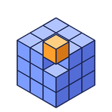
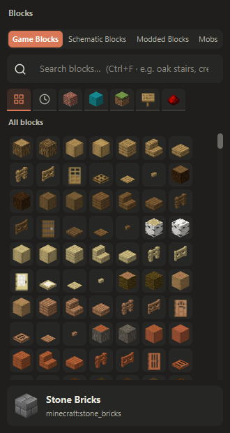
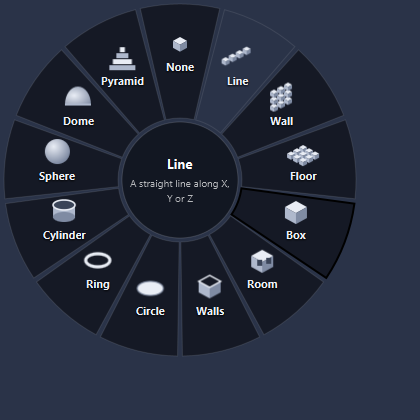
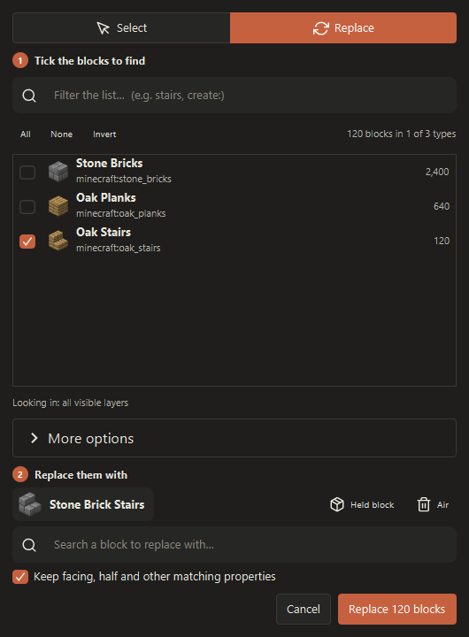
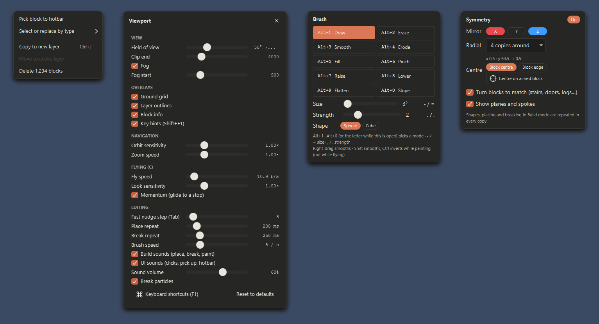

<p align="center">
  
</p>

<h1 align="center">BlockDesigner</h1>

<p align="center">
  A Windows editor for Minecraft builds: design in a Minecraft-style 3D view, arrange schematics as layers,<br>
  and export Litematica, WorldEdit and Create / structure files or a worldgen data pack.
</p>

<p align="center">
  <a href="https://github.com/doolecg/BlockDesigner/releases/latest"></a>
  <a href="https://github.com/doolecg/BlockDesigner/releases"></a>
  <a href="LICENSE"></a>
  
</p>

---

BlockDesigner is a desktop app for planning Minecraft structures outside the game. You build block by block with the controls you know from creative mode (flight, a hotbar, place / break / pick block), use shapes, symmetry, sculpting brushes and WorldEdit-style commands, and keep every imported or new schematic as its own layer. The textures and models come from your own Minecraft install (modded instances too), and nothing from Minecraft is shipped with the app.

**Contents:** [Download](#download-and-install) · [Features](#features) · [Controls](#controls-and-keybinds) · [Plugins](#plugins) · [Building from source](#building-from-source) · [Project layout](#project-layout)

## Download and install

Get the latest version from the [releases page](https://github.com/doolecg/BlockDesigner/releases/latest). There are two downloads:

| File | Use it if… |
|---|---|
| **The installer (`.msi`)** | You want a normal install. It installs to `C:\Program Files\BlockDesigner`, adds Start menu and desktop shortcuts, and makes `.bdproj` projects open in BlockDesigner. Installing a newer version upgrades in place. |
| **The portable zip** (`BlockDesigner-<version>-portable.zip`) | You don't want to install anything. Unzip it anywhere and run `BlockDesigner.exe`. Settings are kept in a `data` folder next to the exe. |

Both include their own Java runtime, so there is nothing else to install.

- **Settings** (theme, keybinds, recent files, plugins) live in `%APPDATA%\BlockDesigner` for the installed version, never in the install folder, so they survive updates and reinstalls. Each new version copies them into `%APPDATA%\BlockDesigner\backups` the first time it starts. Settings › General › Your settings can save a backup to a file, load one (for example on another PC) or reset everything to the defaults.
- **Updates:** when it opens, BlockDesigner checks GitHub for a newer release and shows its notes. **Install and restart** downloads it, checks it against the release's checksum and installs it. You can skip a version, or turn the check off under **Settings › General › Updates**.
- **Windows Smart App Control / SmartScreen:** releases aren't code-signed yet. On PCs with Smart App Control switched on, Windows may block BlockDesigner from starting, even after a successful install or update, and SmartScreen may warn about it.
- **First launch:** pick the Minecraft version whose textures and models to use. You can also pick a modded instance (Prism, CurseForge, Modrinth or the official launcher) so modded blocks, such as Create's, render too.

## Features

### Build like in Minecraft

- Creative flight, a hotbar, and break / place / pick-block controls with Minecraft's repeat timing.
- **Placement** works as in the game: stairs and slabs go top or bottom, logs follow the clicked face, torches and signs go on walls, and doors and beds place both halves. Fences, walls, panes, redstone dust and rails connect to their neighbours.
- **Palette** laid out like the creative menu (Building, Colored, Natural, Functional, Redstone, plus All and Recently used), with Minecraft's own block names from the game's and each mod's language files. Hover a block and press 1–9 to put it in that hotbar slot.
- **Replace** (swap the aimed block, keeping its facing) and **Shuffle** (random blocks from the hotbar) modes.
- **Shapes** (hold Alt in Build mode): line, wall, floor, box, room, walls, circle, ring, cylinder, sphere, dome and pyramid, drawn out with a preview and placed as one undo step. They grow from the face you start on.
- **Symmetry** (M): mirror across X, Y and / or Z, or radial copies around a vertical axis. Stairs, doors, slabs and logs turn to match in every copy.
- **Mobs as stand-ins:** place pigs, villagers, iron golems, armour stands, paintings and more, drawn with Minecraft's models where available. They are saved with the project and exported with the schematic.

<p align="center">
  
  &nbsp;
  
</p>

### Brushes, selections and WorldEdit

- **Sculpting brushes:** draw, erase, smooth, erode, fill, pinch, raise, lower, flatten and slope, with size, strength and shape settings, plus an Eraser. Each stroke is one undo step.
- **Select** blocks by clicking, marquee-dragging or setting pos1 / pos2. **Select or replace by type** (Alt+T) finds blocks by kind and swaps them, keeping facing and other shared properties.
- **Move and Rotate** gizmos (Blender-style) move or turn whole layers or just the selected blocks.
- **Command line** (T or /), like Minecraft's chat: `/set`, `/replace`, `/walls`, `/copy`, `/paste`, `/stack`, `/smooth`, `/sphere` and more, with Tab completion and history. See the command table under [Controls](#controls-and-keybinds) › Select mode and WorldEdit.

<p align="center">
  
</p>

### Layers

- Every schematic, imported or new, is a layer: show / hide, lock, ghost, rename, reorder, duplicate and merge.
- Move layers with the wheel, the arrow keys or the Move gizmo, and turn them in quarter turns.
- The slice view steps through Y levels.

### Import and export

- Import and export **Create / structure-block `.nbt`**, **Litematica `.litematic`** (multi-region) and **WorldEdit `.schem`** (Sponge v2 / v3). Directional blocks stay correct through rotation and mirroring.
- **Export window (Ctrl+E):** a card per format showing what will be exported (layers, blocks, size, block types). It saves straight into a detected instance's `schematics` or `config/worldedit/schematics` folder and remembers your choices.
- **Worldgen data packs (Ctrl+Shift+E):** make a build generate in new chunks, as a single structure (with random variants) or **village-style** with jigsaw pieces: mark layers as the centre, streets or buildings, and BlockDesigner adds the jigsaw blocks and can generate streets. Built-in and saved presets set placement, biomes and blending, and containers can get loot tables. Save the pack as a zip or install it straight into a world, then test with `/place structure <namespace>:<name>`.

### Camera, look and feel

- Orbit and pan like Blender, a view cube, perspective or orthographic, numpad views, and creative flight with momentum.
- **Themes:** Claude, Blue, Green, Red, Orange and Zen, each dark or light or following Windows. A theme colours every window and the 3D view's sky and grid.
- **Keybinds:** every keyboard shortcut can be changed in **Settings › Keybinds** (Ctrl+,), with a second key per action and clash warnings. Key hints in the corner show the keys for what you're doing (Shift+F1).
- Place, break and paint sounds, break particles and quiet UI sounds, each of which can be turned off in the viewport settings (N).
- **Undo and redo** cover every action.

<p align="center">
  
</p>

### Coming soon

- The **Resource Tracker**: the materials a build needs, what you have gathered and what is left.

## Controls and keybinds

These are the default keys. **Every keyboard shortcut can be rebound in Settings › Keybinds**, and the app always shows your current keys: press **F1** (or Alt+K), or click the ⌘ button in the viewport, for the list. Single-letter keys don't fire while you're typing in a text box, and while flying W A S D, Space, Shift and Ctrl belong to flight.

<details open>
<summary><b>Modes and tools</b></summary>

| Key | Action |
|---|---|
| 1 | View mode: look around only |
| 2 | Select mode |
| 3 | Build mode on / off (also while flying) |
| G / R / S | Move / Rotate / Scale tool (gizmos for the selected layers, or the selected blocks) |
| 4 / 5 | Brush / Eraser |
| Esc | Leave Build mode (in Build mode the number keys pick hotbar slots) |
| Esc | Cancel a drag or placement, clear the selection, stop flying, then back to Select |

</details>

<details>
<summary><b>Camera</b></summary>

| Key | Action |
|---|---|
| Middle-drag | Orbit around the point under the mouse |
| Shift+middle-drag | Pan |
| Alt+middle-drag | Swing to the next orthographic view in that direction |
| Wheel | Zoom |
| F | Focus: frame the selected blocks, or else the active layer |
| Home | Frame everything |
| C | Creative flight on / off |
| P / O | Perspective / orthographic |
| Numpad 1 / 3 / 7 | Front / right / top (Ctrl: back / left / bottom) |
| Numpad 9 / 5 | Opposite side / toggle perspective and orthographic |
| Numpad 2 4 6 8 / . | Orbit 15° / frame the active layer |
| View cube | Click a face for that view (again for the opposite side), drag to orbit |

</details>

<details>
<summary><b>Flying</b></summary>

| Key | Action |
|---|---|
| W A S D | Move (W and S follow where you look) |
| Space / Shift | Up / down |
| Ctrl | Sprint |
| Wheel | Next / previous hotbar slot |
| C / Esc | Stop flying |

</details>

<details>
<summary><b>Build mode and hotbar</b></summary>

| Key | Action |
|---|---|
| Left-click | Break (hold to repeat) |
| Right-click | Place (hold to repeat), oriented like Minecraft |
| Middle-click | Pick the block into the hotbar |
| Hold Alt | Shape wheel: point at a shape and let go, then right-drag to draw it |
| M / Shift+M | Symmetry settings / put the symmetry centre on the aimed block |
| Shift+X | Replace mode: right-click swaps the aimed block and keeps its facing |
| Shift+Z | Shuffle mode: place random blocks from the hotbar |
| 1 – 9 (Build mode) | Hold a hotbar slot |
| 1 – 9 over a palette block | Put that block in that hotbar slot, like Minecraft's creative inventory |
| Delete | Empty the held hotbar slot |
| Shift+C | Clear the hotbar |

</details>

<details>
<summary><b>Brush and Eraser</b></summary>

| Key | Action |
|---|---|
| Drag | Paint with the brush mode (Eraser: remove blocks) |
| Right-drag | Smooth |
| Alt+1 … Alt+0 | Draw · Erase · Smooth · Erode · Fill · Pinch · Raise · Lower · Flatten · Slope |
| Shift+right-click | Brush settings: mode, size, strength, shape |
| - / = | Smaller / bigger brush (1–16) |
| , / . | Weaker / stronger brush (1–5) |
| Shift+drag / Ctrl+drag | Smooth / inverse mode (not while flying) |

</details>

<details>
<summary><b>Select mode and WorldEdit</b></summary>

| Key | Action |
|---|---|
| Left-click / right-click | Set pos1 / pos2; the box's blocks become the selection |
| Shift+click / Ctrl+click | Add a block to / remove it from the selection |
| Drag | Marquee select; pos1 and pos2 are set to the corners of the box around the selection |
| Shift+right-click or Menu key | Context menu |
| Alt+T | Select or replace by type |
| Ctrl+A / Alt+A | Select every block of the active layer / deselect |
| Ctrl+J / Ctrl+Shift+J | Copy / move the selection to a new layer |
| Ctrl+R | Fill the selection with the held block |
| Delete | Delete the selected blocks |
| Esc | Clear the region and selection |
| T or / | Command line, like Minecraft's chat (Tab completes, ↑ ↓ history) |

Commands take one slash and work on every visible, unlocked layer:

| Command | Action |
|---|---|
| `/pos1`, `/pos2` [x y z] | Set a corner (default: the block you aim at) |
| `/set <pattern>` | Fill the region, e.g. `stone`, `70%stone,30%andesite`, `hand` |
| `/replace [from] <to>` | Replace blocks |
| `/walls`, `/faces`, `/overlay`, `/center` `<pattern>` | Side walls, all faces, a layer on top, the middle |
| `/smooth [passes]`, `/naturalize` | Smooth the terrain · grass, dirt and stone by depth |
| `/hollow [thickness] [pattern]` | Hollow out shapes, keeping a shell |
| `/copy`, `/cut`, `/paste [-a] [-s]`, `/rotate`, `/flip` | Clipboard, relative to pos1 |
| `/move`, `/stack` `[n] [dir] [-a]` | Move or repeat the region's contents |
| `/expand`, `/contract`, `/shift` `<n> [dir]`, `/outset`, `/inset` | Resize or move the region |
| `/line`, `/sphere`, `/cyl`, `/pyramid` (`/h…` hollow) | Shapes at pos1 |
| `/count`, `/distr`, `/size`, `/sel` | Region info, clear the region |
| `/undo`, `/redo`, `/help` | Undo, redo, list commands |

</details>

<details>
<summary><b>Move, Rotate and Scale tools</b></summary>

| Action | Result |
|---|---|
| Drag an arrow / square / the centre | Move along an axis / in a plane / freely |
| Drag a ring | Turn in 90° steps |
| Scale: drag a square handle / the centre | Stretch along that axis / scale evenly (whole blocks, nearest neighbour) |
| Click a layer | Select it (Shift adds) |
| Esc / right-click | Cancel the drag |

</details>

<details>
<summary><b>Layers</b></summary>

| Key | Action |
|---|---|
| Ctrl+wheel | Move along the axis of the layer's bounding-box side under the mouse |
| Ctrl+Shift+wheel | Up / down |
| Shift+wheel (outside Build mode) | Same as Ctrl+wheel |
| Arrow keys, hold Tab | Move, bigger steps |
| Alt+wheel (Shift+wheel in Build mode) | Turn by the bounding-box side under the mouse: spin (top or bottom) or flip (a side) |
| Wheel / Alt+wheel in Build mode | Hotbar slot / zoom |
| [ / ] | Make the layer below / above active |
| Ctrl+Shift+N / Ctrl+D / Ctrl+M | New / duplicate / merge |
| F2 | Rename the active layer |
| H / Alt+H / Shift+H | Hide or show / show every layer / ghost |
| L | Lock or unlock |
| Shift+Delete | Delete the selected layers |
| PgUp / PgDn, Insert | Slice view: step through Y levels, single level |
| Click / Enter, R, Esc | Placing an import: place, rotate, cancel |

</details>

<details>
<summary><b>File, edit and view</b></summary>

| Key | Action |
|---|---|
| Ctrl+N / Ctrl+O / Ctrl+I | New / open / import |
| Ctrl+S / Ctrl+Shift+S | Save / save as |
| Ctrl+E / Ctrl+Shift+E | Export schematic / worldgen data pack |
| Ctrl+Z / Ctrl+Y (Ctrl+Shift+Z) | Undo / redo |
| Ctrl+F | Search blocks |
| Ctrl+, | Settings |
| N | Viewport settings |
| Alt+G | Ground grid on / off |
| F1 / Alt+K | Keyboard shortcuts |
| Shift+F1 | Key hints on / off |
| F11 | Full screen |

</details>

## Plugins

Plugins are `.jar` files that add schematic formats, exporters, importers, menu actions, `/commands`, transforms with a live preview, side panels and tools. Manage them under **Plugins (puzzle icon) › Manage plugins…**, where you can install, enable or disable, reload and uninstall them. Plugins run with the same access as BlockDesigner itself, so only install ones you trust.

To write one, see **[PLUGINS.md](PLUGINS.md)** (guide), [docs/plugin-api-reference.md](docs/plugin-api-reference.md) (every API type) and the examples [`examples/hello-plugin`](examples/hello-plugin) and [`examples/palette-tools`](examples/palette-tools).

## Building from source

Requires JDK 25+ (the build uses a Java 26 toolchain; `gradle.properties` points Gradle at a local Temurin 26, so change `org.gradle.java.home` to your own JDK).

```
./gradlew :app:run
```

### Windows builds

- `./gradlew :app:portable` builds `dist/BlockDesigner/BlockDesigner.exe` and `dist/BlockDesigner-<version>-portable.zip`. The Java runtime is bundled, and settings are kept in a `data` folder next to the exe.
- `./gradlew :app:installer` builds `dist/BlockDesigner-<version>.msi`, which installs to `C:\Program Files\BlockDesigner` with Start menu and desktop shortcuts, and makes `.bdproj` saves show the BlockDesigner icon and open in the app. It needs the WiX Toolset: unzip the [WiX 3.14 binaries](https://github.com/wixtoolset/wix3/releases) into `tools/wix3`, or have WiX on PATH.
- The version is `version` in the root `build.gradle.kts`. The icon is drawn by `packaging/make_icon.py` (needs Pillow); rerun it after changing the design.

### Code signing

Windows Smart App Control blocks unsigned programs it doesn't recognise, and SmartScreen warns about them. Every release is a new, unknown file, so releases should be signed. When a certificate is set up, `:app:portable` and `:app:installer` sign:

- `BlockDesigner.exe`;
- the installer;
- the native DLLs that JavaFX, LWJGL and JNA unpack from their jars at runtime (they ship unsigned).

The Java runtime's own DLLs are already signed by Eclipse and Microsoft. Without a certificate, the build warns and leaves everything unsigned.

1. Run `./gradlew :app:fetchSigntool` once. It downloads `signtool.exe` from Microsoft's SDK build tools on nuget.org into `tools/signtool`, which is git-ignored. An installed Windows SDK works too.
2. Put the signtool options in `~/.gradle/gradle.properties` as `blockdesigner.sign.args`, or in the `BLOCKDESIGNER_SIGN_ARGS` environment variable. Never put them in the repo. The value is everything between `signtool sign` and the file names:
   - A certificate in the Windows store, such as a USB token or Certum SimplySign: `/sha1 <thumbprint> /fd SHA256 /tr http://time.certum.pl /td SHA256`
   - A `.pfx` file: `/f C:\certs\blockdesigner.pfx /p <password> /fd SHA256 /tr http://timestamp.digicert.com /td SHA256`
   - Azure Trusted Signing: `/fd SHA256 /tr http://timestamp.acs.microsoft.com /td SHA256 /dlib <path>\Azure.CodeSigning.Dlib.dll /dmdf <path>\metadata.json`

   In `gradle.properties`, write a backslash as `\\` or use forward slashes (`C:/certs/blockdesigner.pfx`). A path with spaces goes in double quotes.
3. For releases, add `-Pblockdesigner.sign.required=true`. The build then fails instead of quietly shipping unsigned files.

A self-signed certificate signs fine but doesn't satisfy Smart App Control or SmartScreen. The certificate has to come from a code-signing authority that Windows trusts.

### Tests

```
./gradlew test
```

The integration tests in `assets` and `render` use your local Minecraft install and `testdata/` when they exist, and are skipped otherwise. With `UI_SNAPSHOTS=1`, the `*UiSnapshotsIT` tests render the app's windows and panels to PNGs in `app/build/ui-snapshots` (the screenshots in this README come from there).

## Project layout

| Module | What it does |
|---|---|
| `core` | NBT, block states, sparse structures, layers and scenes, undo, transforms, schematic formats, `.bdproj` projects |
| `assets` | Finds installs; loads blockstates, models and textures from game, mod and resource-pack jars; bakes models; builds the texture atlas |
| `render` | LWJGL / OpenGL offscreen renderer (MSAA, smooth AO, sorted translucency), meshing on worker threads, picking |
| `worldgen` | Data pack exporter: single structures and village-style jigsaw layouts |
| `plugin-api` | The API third-party plugins compile against |
| `app` | JavaFX UI (AtlantaFX theme), plugin manager, updater |
| `examples/hello-plugin` | Sample plugin for API 1, also used by the tests |
| `examples/palette-tools` | Sample plugin for API 2 (transforms, panel, tool, importer, exporter), also used by the tests |
| `packaging` | Icon source (`make_icon.py`) and Windows packaging resources |

## License

[MIT](LICENSE)
